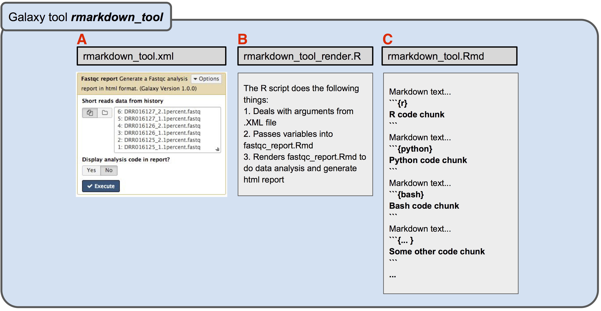
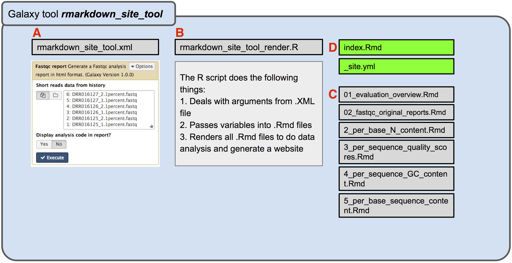

## Galaxy R Markdown Tools

Galaxy R Markdown Tools use R markdown as a framework to wrap multiple tools and/or scripts from different 
programming languages into a single tool and generate an R markdown document in the format of either single HTML or a web site. 
Technically, all Galaxy tools can be wrapped in the R Markdown framework to provide well-organized HTML outputs with better
data visualization.

## [See the Example outputs](https://mingchen0919.github.io/galaxy-r-markdown-tools/)

## Structure of the Galaxy R Markdown tool repository

To develop an R Markdown Galaxy tool, three types of files are required : 1) an XML tool config file 
(Figure 1.A) which defines the web interface of the Galaxy tool and deals with tool dependencies, 2) R scripts 
(Figure 1.B) that function as a command line application, 3) R markdown files (Figure 1.C) which are template 
files for generating the final HTML report and perform the real data analysis process. All the data analysis are 
defined in this file.

See an example tool from Galaxy tool shed: [rmarkdown_fastqc_report](https://toolshed.g2.bx.psu.edu/repository?repository_id=b88fddb3425cab4e&changeset_revision=a6f8382f852c)
and an [example output](https://mingchen0919.github.io/galaxy-r-markdown-tools/fastqc_report/fastqc_report_html.html#fastqc_report_html) from this tool. 

Galaxy allows creating an extra files directory that is associated with a specific output. With this advantage, we can 
create Galaxy R Markdown tools that output a static website. The figure below show the structure of an R Markdown tool
which output a static website.

