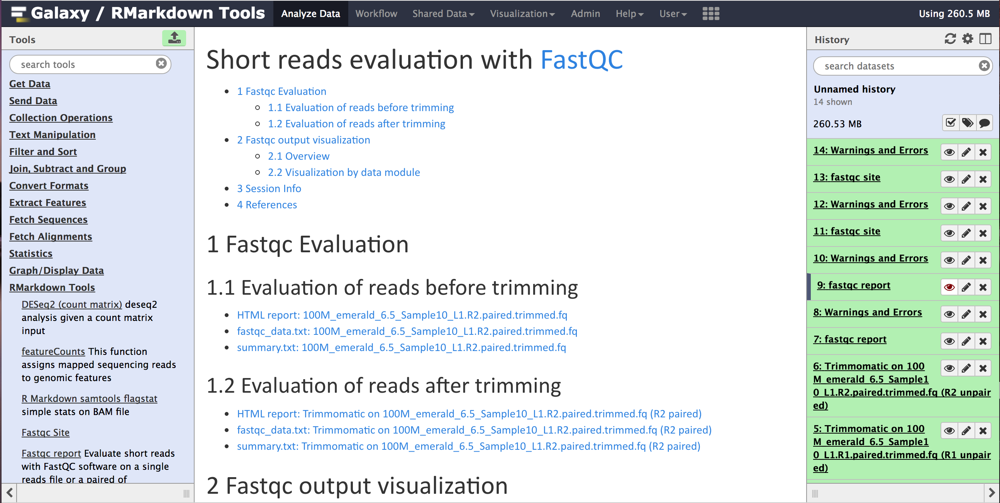
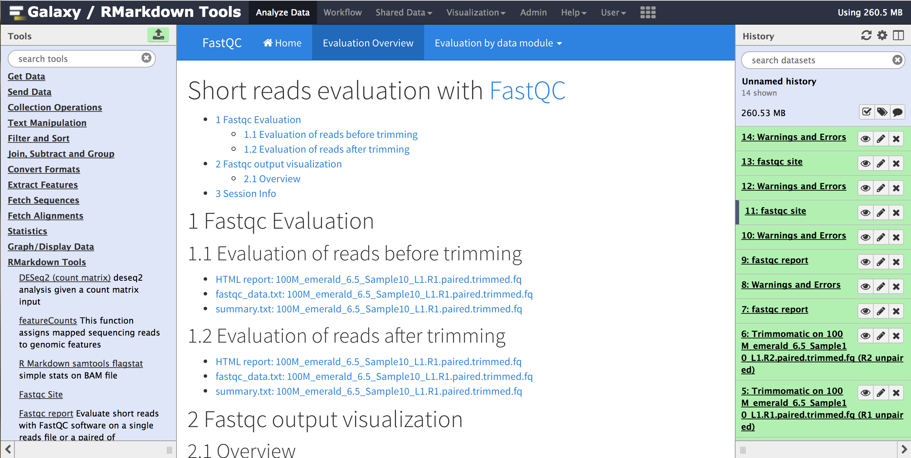
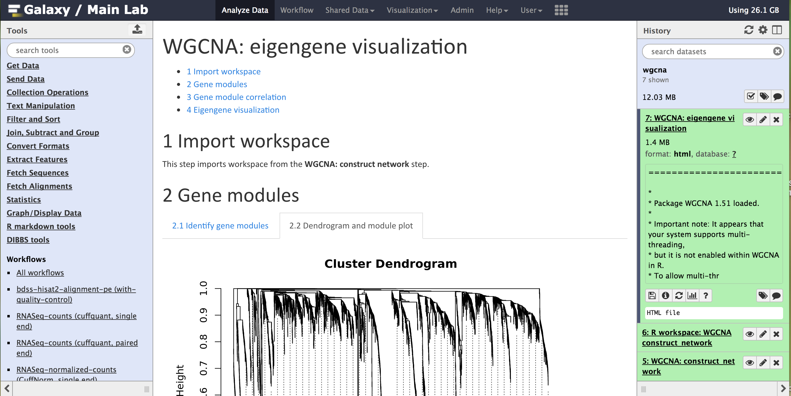
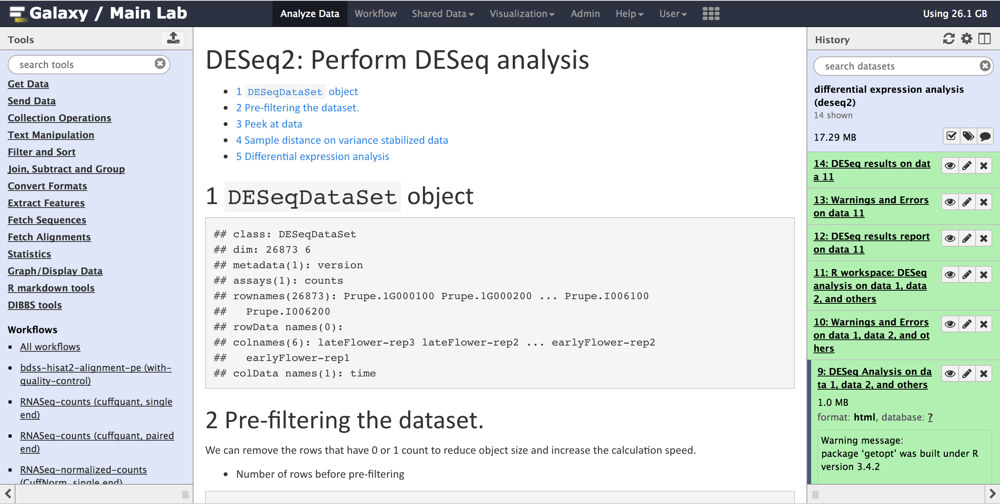
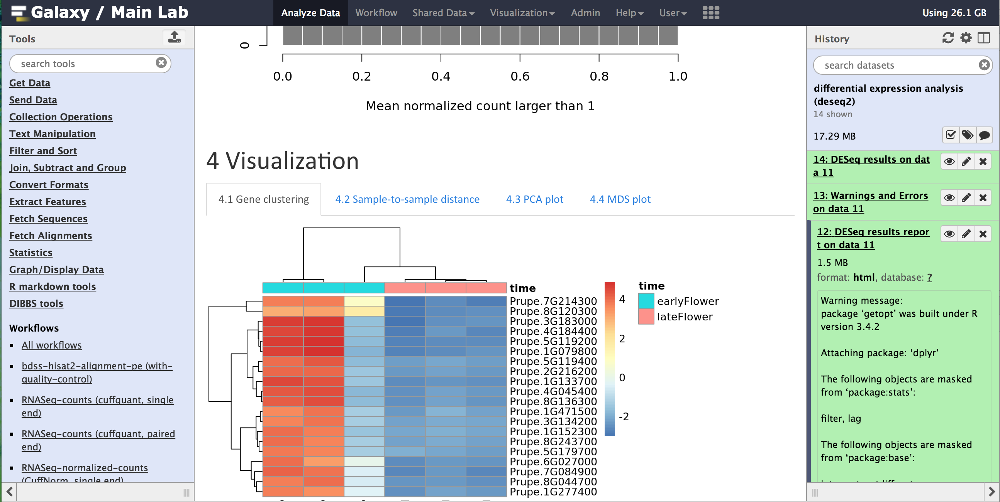
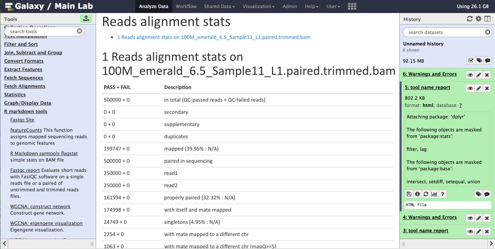

<style>
pre code, pre, code {
  white-space: pre !important;
  overflow-x: scroll !important;
  word-break: keep-all !important;
  word-wrap: initial !important;
}
</style>

```{r setup, include=FALSE}
knitr::opts_chunk$set(echo = FALSE)
```


## [rmarkdown_fastqc_report](fastqc_report/fastqc_report_html.html)

```{r}

```

## [rmarkdown_fastqc_site](fastqc_site/index.html)

```{r}

```

## [rmarkdown_wgcna:construct_network](wgcna/WGCNA__construct_network_html.html)

```{r}
knitr::include_graphics('images/rmarkdown_wgcna_construct_network.png')
```

## [rmarkdown_wgcna:eigengene_visualization](wgcna/WGCNA__eigengene_visualization_html.html)

```{r}

```

## [rmarkdown_deseq2:analysis](deseq2/DESeq_Analysis_html.html)

```{r}

```

## [rmarkdown_deseq2:results](deseq2/DESeq_results_report_html.html)

```{r}

```

## [rmarkdown_samtools_flagstat](samtools_flagstat/samtools_flagstat_report_html.html)

```{r}

```

